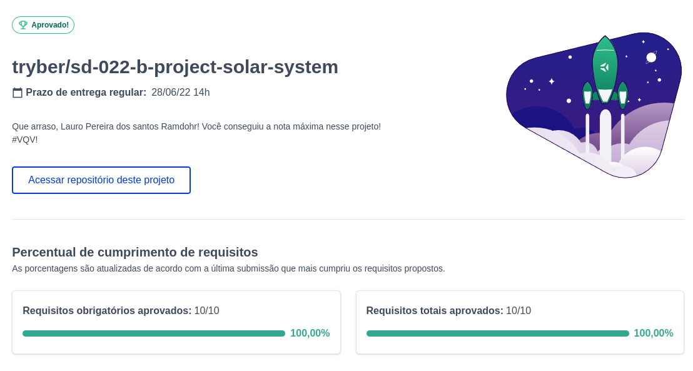

# :artificial_satellite: Solar System

<!--  -->

## Acesse meu projeto <a href="https://lauropera.github.io/solar-system/">AQUI</a>

## :satellite: Desenvolvimento

Nesse projeto desenvolvemos nosso conhecimento prévio em React. Colocamos em prática o passo a passo para construir um componente e renderizá-lo na tela.

## :hammer_and_wrench: Tecnologias

* HTML
* CSS
* JavaScript
* React

## :heavy_check_mark: Nota

